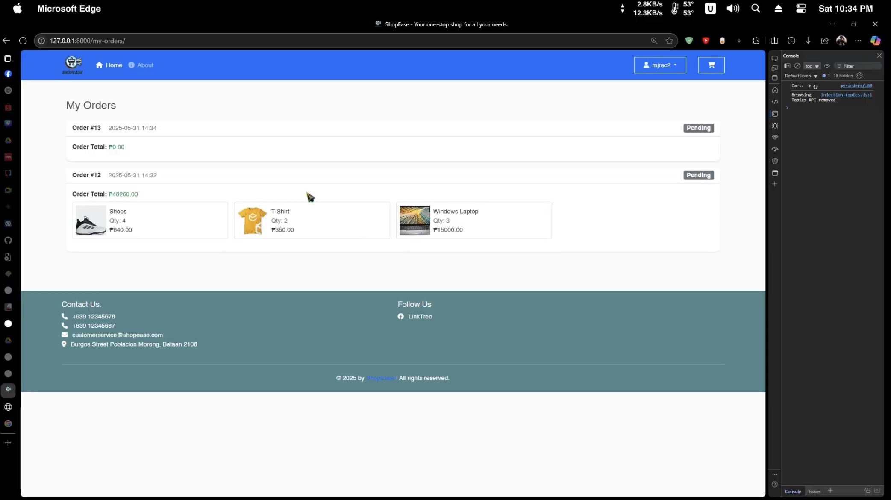
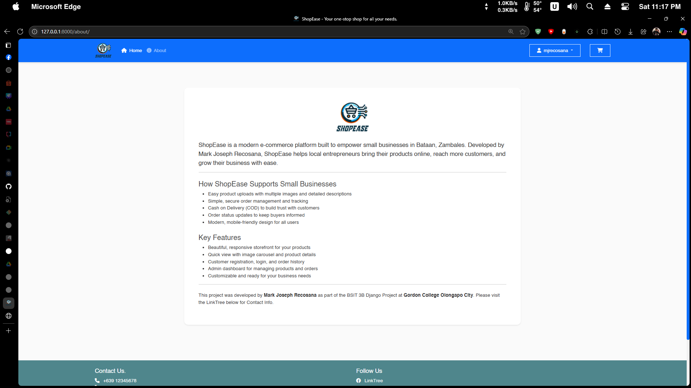

# 🛒 Django E-Commerce Project ShopEase

**Mark Joseph Recosana | BSIT 3B**

This is a simple yet functional E-Commerce web application built with Django. It supports features like browsing products, adding items to cart, checking out with shipping details, and placing orders using **Cash on Delivery (COD)**.

---

## 📸 Screenshots

### Home Page


### Store Page


### Cart Page


### Checkout Page


### Order History


### About Page


### Register Page


### Login Page


---

## 🔧 Features

* ✅ Product Listing & Image Support
* ✅ Add/Remove Items from Cart
* ✅ Guest Checkout (no login required)
* ✅ Cash on Delivery (COD) Payment Method
* ✅ Shipping Address Collection
* ✅ Admin Panel for Managing Orders & Products

---

## 🖥️ Technologies Used

* Python 3.x
* Django 3.x or 4.x
* HTML / CSS / Bootstrap
* JavaScript (vanilla)
* SQLite (default Django DB)

---

## 🚀 Installation Guide

Follow these steps to set up and run the project locally:

### 1. Clone the Repository

```bash
git clone https://github.com/mjrecosana06/DJANGO-ECommerce-Mark-Joseph-Recosana-BSIT-3B.git
cd DJANGO-ECommerce-Mark-Joseph-Recosana-BSIT-3B
```

### 2. (Recommended) Create and Activate a Virtual Environment

**Windows:**
```bash
python -m venv venv
venv\Scripts\activate
```
**macOS/Linux:**
```bash
python3 -m venv venv
source venv/bin/activate
```

### 3. Install Dependencies

```bash
pip install -r requirements.txt
```

### 4. Apply Migrations

```bash
python manage.py migrate
```

### 5. Create a Superuser (Admin Account)

```bash
python manage.py createsuperuser
```
Follow the prompts to set up your admin credentials.

### 6. Run the Development Server

```bash
python manage.py runserver
```

### 7. Access the Application
- Open your browser and go to: [http://127.0.0.1:8000/](http://127.0.0.1:8000/)
- Admin panel: [http://127.0.0.1:8000/admin/](http://127.0.0.1:8000/admin/)

You're all set! 🎉
